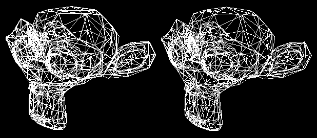

# ICG-2nd-Pipeline
---

## Introdução
Este projeto aborda e implementa o processo de construção do pipeline gráfico, bem como a importação e rasterização de objetos utilizando-se do mesmo. Para tanto, é usado um framework modificado (https://raw.githubusercontent.com/VictorKoehler/ICG-1st-BresenhamAlgorithm) com base em um de fins didáticos disponibilizado por Christian Pagot, professor da Universidade Federal da Paraíba, da qual este trabalho se destina como complemento de nota da disciplina de Introdução à Computação Gráfica, período 2018.1.

Discente: Victor José de Sousa Koehler

Matrícula: 20170068974

<br /><br /><br /><br />

---

## Dependências
Eigen<sup>[0]</sup>: http://eigen.tuxfamily.org

Assimp: http://assimp.org/

<br /><br />

---

## O Projeto
Este projeto é uma continuação do trabalho de desenvolvimento de um framework didático de rasterização. Detalhes de uso, implementação e documentação do mesmo não fazem parte do escopo deste trabalho. Para mais informações, visite: https://github.com/VictorKoehler/ICG-1st-BresenhamAlgorithm

<br /> <br />

Este projeto está dividido conceitualmente da seguinte forma:
- main.h, mygl.h, definitions.h: Framework base de rasterização.
- eigen-folder: Biblioteca Eigen para cálculos númericos/algébricos.
- pipeline.m, pipeline2.m: Material de apoio fornecido pelo docente (modificado).
- Esfera.obj, monkey_head2.obj: Material usado como exemplo. Origem: Blender<sup>[1]</sup>
- main.cpp: Inicialização
- pipeline_extensions.h: Componente comunicante entre Framework de rasterização <-> Pipeline+Espaco
- common.h: Contém algumas implementações comuns a várias partes do projeto, especificamente, contém métodos para gerar matrizes bem conhecidas, como as bases e transformações bem conhecidas, como as matrizes de translação e rotação, por exemplo.
- scene.h: Contém a classe Scene, responsável parcial do Pipeline (view, projection, viewport), bem como armazena os objetos da cena. Atua como se fosse um "universo".
- objectmodel.h: Representa um objeto (modelo), contendo os vértices e a matriz Model.
- examples.h: Contém os exemplos de implementação e importação.
- opengl_test.cpp: Programa de testes para servir de comparação entre o Pipeline desenvolvido e o OpenGL. Possui um loader (ObjectModel) embutido.

<br /> <br />

---

## Funcionamento
O projeto é constituido de três partes principais + extensões e exemplos:
Fundamentalmente, é necessário instanciar um objeto do tipo Scene, o qual conterá os objetos (modelos) da "*cena*" bem como a configuração do espaço e da câmera (Pipeline). Recomenda-se, pelo menos como referência, o uso do segundo construtor da classe, isto é, `Scene(Vector3f camera_position, Vector3f camera_lookAt, Vector3f camera_up, float camera_dist, int screen_width, int screen_height)`, pela praticidade e clareza do mesmo. A classe ainda dispõe de métodos construtores das matrizes do Pipeline, bem como de um método de carregamento de objetos.

A classe ObjectModel contém todos os objetos visíveis, sendo formada por um conjunto de vértices de triângulos, bem como contém a matriz Model (individual ao objeto).

Note que para importar um modelo de um arquivo é possível usar o método `int loadObject(const std::string &file_name)` da classe Scene, que por sua vez adiciona automaticamente tal objeto em seu escopo.

Além disso, um importante detalhe na implementação dessas classes é a exposição do nível de acesso das matrizes (Model, no caso de ObjectModel; View, Projection e Viewport no caso de Scene) e de seus containers (Vector de Vertice, no caso de ObjectModel; Vector de ObjectModel, no caso de Scene), possibilitando acesso direto e otimizado dessas propriedades.

Isso é especialmente útil somado as implementações presentes em common.h, pois possibilitam, por exemplo, aplicar transformações no Model de um objeto, ou por exemplo, aplicar rotações em matrizes do Pipeline (Sugere-se que este exemplo seja seguido apenas em caso de experimentos em ambientes controlados e protegido por backups regulares). Por exemplo, para rotacionar um objeto O: `O.model *= createRotationAboutXMatrix(0.01) * createRotationAboutYMatrix(0.01);`

Por fim, o arquivo examples.h contém diversos trechos de código, incluindo testes das implementações.

<br /> <br />

---

## Detalhes e Especificação de Implementação
Para a fase de rasterização, faz-se uso de pipeline_extensions.h, que, assim como já mencionado acima, realiza a integração Pipeline <-> Framework.

Neste arquivo, destacam-se duas funções a serem usadas: `drawSpace(Space)` e `drawFreezedPreComputedSpace(Scene)`. A Primeira percorre todos os vértices de todos os objetos e rasteriza-os logo após transforma-los através do Pipeline.

A Segunda função é um experimento na qual todos os vetores dos vértices precisam ser calculados previamente de forma simultânea na forma de matrizes, isto é, na forma `Mv = [v0; v1; v2; ...; vN]`, sendo vi um vetor linha de tamanho L e Mv uma matriz contendo N vetores lado a lado (isto é, tamanho LxN). Isso tira proveito das otimizações e do paralelismo disponibilizados pelo hardware e pela biblioteca, bem como permite o redesenhamento apenas de objetos especificos da cena. Mais detalhes estão disponíveis nos Experimentos e nos exemplos.

<br />

Para a implementação de Scene, foi usado como referência o material disponibilizado pelo docente, especificamente, os arquivos pipeline.m e pipeline2.m. 

Como a classe atua como um espaço universal + câmera, os seguintes métodos modificam as matrizes do pipeline, e por consequência, o comportamento da classe:
- buildCameraByDirection, buildCameraByLookAt: Recria a matriz View. Ou seja, redefine a câmera, de acordo com os três vetores passados a uma das funções, isto é, position, direction, up (No caso de buildCameraByLookAt: direction = lookAt - position).
- buildProjectionMatrix: Recria a matriz Projection, recebe d como argumento, isto é, a distância do foco e do plano de projeção.
- buildViewportMatrix: Recria a matriz Viewport, recebe o tamanho da tela (horizontal e vertical, respectivamente).
- buildPipeline: Recria a matriz do Pipeline (sem Model). Necessário ser chamado depois de qualquer modificação nas matrizes anteriores. É simplesmente `pipeline = viewport * projection * view;`.


<br /> <br />


## Resultados

<p align="center">
	<br>
	
	<h5 align="center">monkey_head2.obj: Renderizado neste projeto e no OpenGL, respectivamente.</h5>
</p>
<br /><br />
<p align="center">
	
	<h5 align="center">Esfera.obj: Renderizado neste projeto e no OpenGL, respectivamente.</h5>
	<br>
</p>

Consulte main.cpp para a execução dos exemplos do Pipeline do projeto. (Cubo, Esfera e Macaco)

Consulte opengl_test.cpp para a execução dos exemplos no OpenGL. (Esfera e Macaco)

<br /> <br />


## Experimentos

<p align="center">
	<br>
	
	<h5 align="center">Experimento de alteração direta nas matrizes do Pipeline. Detalhes abaixo:</h5>
	<br>
</p>

```c++
e.view *= createScaleMatrix(1.3, 1.1, 1, 0.4);
e.viewport *= createRotationAboutYMatrix(0.7);
e.buildPipeline();
e.invalidateAllObjects();
```

<br /> <br />

## Dificuldades Encontradas
<!-- Das war Einfach -->
Pode-se apontar, como principal ponto de dificuldade, a escassez de documentação e literatura de fácil acesso e compreensão sobre os temas e ferramentas usadas.

<br /> <br /> <br />


## Referências


0. _Por questões de compatibilidade e praticidade, optou-se por copiar e manter a biblioteca Eigen 3.3.5 na pasta eigen-folder. Este projeto e autor não possui qualquer vínculo, relação ou posse com o projeto Eigen e seus autores. Para mais informações, visite: http://eigen.tuxfamily.org_
1. _https://blender.org/_
